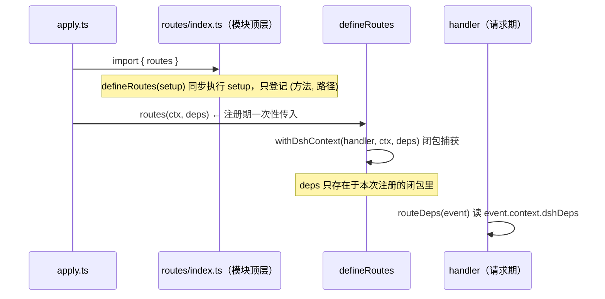

# dsh-tauri 路由依赖注入（方案 B：`event.context`）

> 目标：让每个插件的 `host/routes/index.ts` 回到规范形态 —— 模块顶层一行
> `export const routes = defineRoutes(...)`，**没有 `createRoutes(deps)` 包装，
> 没有 `bindRouteDeps` 模块级单例**，同时保留 apply 期依赖的可达性。

- 状态：调研 + 设计（尚未实现）
- 适用包：`packages/dsh-tauri`（共享基础设施）、`dsh-tauri-worktree`、
  `dsh-tauri-turnrewind`、`dsh-tauri-panel-scheduler`、`dsh-tauri-panel-extension`
- 不适用包：`dsh-tauri-rightclick`、`dsh-tauri-pet`、`dsh-tauri-session`（零依赖，无需改动）

## 目录

- [1. 现状：两套形态并存](#1-现状两套形态并存)
- [2. 问题：`bindRouteDeps` 为什么奇怪](#2-问题bindroutedeps-为什么奇怪)
- [3. 目标形态](#3-目标形态)
- [4. 方案 B 机制设计](#4-方案-b-机制设计)
- [5. 依赖传递时机：为什么是注册期](#5-依赖传递时机为什么是注册期)
- [6. 类型设计](#6-类型设计)
- [7. 文件级改动清单](#7-文件级改动清单)
- [8. 各包迁移顺序](#8-各包迁移顺序)
- [9. 测试迁移](#9-测试迁移)
- [10. 被否决的替代方案](#10-被否决的替代方案)
- [11. 本方案不解决的问题](#11-本方案不解决的问题)
- [12. 验收清单](#12-验收清单)
- [13. 未决问题](#13-未决问题)

---

## 1. 现状：两套形态并存

仓库里同一件事有两种写法，差异只在于「处理器是否需要 apply 期依赖」：

| 包 | `host/routes/index.ts` 形态 | 依赖注入方式 |
| --- | --- | --- |
| `dsh-tauri-rightclick` | `export const routes = defineRoutes(...)`（`:24`） | 无依赖 |
| `dsh-tauri-pet` | `export const routes = defineRoutes(...)`（`:18`） | 无依赖 |
| `dsh-tauri-session` | `export const routes = defineRoutes(...)`（`:48`） | 无依赖 |
| `dsh-tauri-worktree` | `export function createRoutes(options)` → `defineRoutes(...)`（`:53`、`:63`） | `bindRouteDeps` 单例 |
| `dsh-tauri-turnrewind` | `export function createRoutes(options)`（`:42`、`:48`） | `bindRouteDeps` 单例 |
| `dsh-tauri-panel-scheduler` | `export function createRoutes(deps)`（`:44`、`:46`） | `bindRouteDeps` 单例 |
| `dsh-tauri-panel-extension` | `export function createRoutes(options)`（`:71`、`:77`） | `bindRouteDeps` 单例 |

三个零依赖包已经是目标形态，且 `apply` 里就是
`ctx.effect(() => routes(ctx), '<plugin>: routes')`（如
`packages/dsh-tauri-rightclick/src/host/apply.ts:19`、`packages/dsh-tauri-pet/src/host/apply.ts:38`）。
**方案 B 要做的是把后四个包收敛到同一形态**，而不是发明第三种机制。

规范原文（`docs/plugins/dsh-tauri-设计重构迁移.md:3-17`）第 1 条本来就只写了：

```ts
// host/routes/index.ts
const routes = defineRoutes(disposer => {
  disposer.post({ ... }, postFeature)
  disposer.get({ ... }, getFeature2)
})

ctx.effect(() => routes(ctx), '...')
```

没有 `createRoutes`、没有 `deps.ts`。所以 `bindRouteDeps` 是超出既定协议的第四种自造机制。

## 2. 问题：`bindRouteDeps` 为什么奇怪

`packages/dsh-tauri-worktree/src/host/routes/deps.ts` 的全文只有 24 行，核心是第 12 行的模块级
`let bound`，配 `bindRouteDeps`（写）与 `routeDeps()`（读）。问题不在于「多包了一层」，而在于
**请求期去读一个模块级可变全局**：

| 缺陷 | 证据 |
| --- | --- |
| **跨实例串台（真 bug）** | `deps.ts:14-17` 注释自述「重复调用以最后一次为准」。同一份声明被两组 deps 各注册一次（单测在同一进程里建多个 harness 即命中）时，第二次 `bindRouteDeps` 覆盖 `bound`，**先注册的路由会改读后者的 deps** |
| **卸载不清理** | `bound` 永不置空。插件 dispose 后仍持有 `discardJobs` 的 `Map` 与在飞 Promise，直到下次 apply 覆盖 |
| **测试互相污染** | 测试必须先 bind 再发请求；同文件挂两次即串。旁证：`packages/dsh-tauri-worktree` 与 `packages/dsh-tauri-turnrewind` **至今没有任何 `routes/**/*.test.ts`**，而有测试的两个包都走 `createRoutes(deps)(ctx)`（`packages/dsh-tauri-panel-scheduler/src/host/routes/index.test.ts:126`、`packages/dsh-tauri-panel-extension/src/host/routes/index.test.ts:97`） |
| **签名说谎** | handler 静态类型是 `(event) => ...`，实际依赖模块全局；IDE 跳转与类型检查都看不到这层依赖 |
| **多一层间接** | 每个 handler 都要写一遍 `const { worktreesRoot, discardJobs } = routeDeps()`，共 21 处（worktree 6 + turnrewind 3 + scheduler 1 + extension 11） |

另外，`ResolvedRouteDeps`（如 `packages/dsh-tauri-worktree/src/host/routes/index.type.ts:22-25`）
存在的唯一理由是「把 `createRoutes` 自建的 `discardJobs` 塞进单例」—— 说明这组类型不是为了表达领域，
而是为了迁就注入机制。

## 3. 目标形态

```ts
// packages/dsh-tauri-worktree/src/host/routes/index.ts —— 模块顶层，协议原样
import { defineRoutes } from 'dsh-tauri'
import type { WorktreeRouteDeps } from '../types'
import attach from './attach/post'
import bindings from './bindings/get'
import checkout from './checkout/post'
import deleteWorktree from './delete'
import postWorktree from './post'
import status from './status/get'

export const routes = defineRoutes<WorktreeRouteDeps>((disposer) => {
  disposer.post({ kind: 'exact', path: '/api/desktop/dsh-tauri-worktree' }, postWorktree)
  disposer.delete({ kind: 'exact', path: '/api/desktop/dsh-tauri-worktree' }, deleteWorktree)
  disposer.get({ kind: 'exact', path: '/api/desktop/dsh-tauri-worktree/bindings' }, bindings)
  disposer.get({ kind: 'exact', path: '/api/desktop/dsh-tauri-worktree/status' }, status)
  disposer.post({ kind: 'exact', path: '/api/desktop/dsh-tauri-worktree/bindings' }, attach)
  disposer.post({ kind: 'exact', path: '/api/desktop/dsh-tauri-worktree/checkouts' }, checkout)
})
```

```ts
// packages/dsh-tauri-worktree/src/host/apply.ts
const deps: WorktreeRouteDeps = {
  config: cfg,
  worktreesRoot,
  discardJobs: createDiscardJobs({
    ctx,
    worktreesRoot,
    linkDependencyDirectories: cfg.linkDependencyDirectories,
  }),
}
ctx.effect(() => routes(ctx, deps), 'dsh-tauri-worktree: routes')
```

```ts
// packages/dsh-tauri-worktree/src/host/routes/status/get.ts
export default defineEventHandler(async (event) => {
  const { worktreesRoot, discardJobs } = routeDeps<WorktreeRouteDeps>(event) // ← 从事件取，不读全局
  // …其余不变
})
```

三点收益：**handler 签名仍是 `(event) => ...`**、**deps 由注册调用点显式给出（可 grep、可类型检查）**、
**模块级可变状态归零**。

## 4. 方案 B 机制设计

`defineRoutes` 已经把宿主 ctx 挂到 `event.context.dsh`（`packages/dsh-tauri/src/host/routes/index.ts:152-157`
的 `withDshContext`）。方案 B 就是**在同一次包裹里顺带挂上 deps**，因为 h3 的 `event.context` 本来就是
承载「随请求传递的装配期上下文」的官方通道（h3 的 `H3EventContext` 继承 srvx 的
`ServerRequestContext`，带 `[key: string]: unknown` 索引签名；仓库自己的注释
`packages/dsh-tauri/src/host/routes/index.ts:136-138` 已经这么描述）。



关键：**deps 被注册时的闭包捕获**（`withDshContext(handler, ctx, deps)`），不再有模块级共享。
两次注册各持有各自的 deps，串台问题从机制上消失。

`dsh-tauri` 侧的实现改动很小：

```ts
// packages/dsh-tauri/src/host/routes/index.ts
function withDshContext<Deps>(handler: EventHandler, ctx: RoutesContext, deps: Deps): EventHandler {
  return (event) => {
    event.context.dsh = ctx
    event.context.dshDeps = deps
    return handler(event)
  }
}
```

同时新增一个与既有 `dshContextOf`（`:142-144`）对称的类型化读取器：

```ts
/** 类型化读取子路由里的注册期依赖（由 registerRoutes(ctx, deps) 传入）。 */
export function dshRouteDepsOf<Deps>(event: H3Event): Deps | undefined {
  return event.context.dshDeps as Deps | undefined
}
```

各插件的 `routes/deps.ts` 退化为「类型 + 一个带报错的读取器」，不再持有状态：

```ts
// packages/dsh-tauri-worktree/src/host/routes/deps.ts
import type { H3Event } from 'h3'
import type { WorktreeRouteDeps } from '../types'
import { dshRouteDepsOf } from 'dsh-tauri'

/** 取回随注册传入的依赖；缺席说明注册路径不合协议，直接抛错而不是静默降级。 */
export function routeDeps(event: H3Event): WorktreeRouteDeps {
  const deps = dshRouteDepsOf<WorktreeRouteDeps>(event)
  if (!deps)
    throw new Error('dsh-tauri-worktree: 路由依赖未随注册传入（apply 必须调用 routes(ctx, deps)）')
  return deps
}
```

## 5. 依赖传递时机：为什么是注册期

**这是本方案唯一需要决策的点。** 最初草案写的是 `defineRoutes(deps, setup)`，那个签名**不成立**：
`defineRoutes` 必须在模块顶层调用，而 deps 只在 apply 期才存在 —— 两者不可能同时满足。
所以 deps 只能推迟到注册期传入。

这个时序有代码依据：`defineRoutes` 的 setup 回调是**声明期同步执行**的
（`packages/dsh-tauri/src/host/routes/index.ts:83` 就是 `setup(createDisposer(collected))`，
`:84-85` 说明「声明期即快照」）。也就是说声明期只登记「哪个方法打到哪个路径」，
**此刻不需要 deps**；deps 只在请求期才被 handler 读取。

| 方案 | 模块顶层形态 | 结论 |
| --- | --- | --- |
| `defineRoutes(deps, setup)` | 需要 apply 期传 deps → **不可能**在模块顶层 | ✗ 时序矛盾，废弃 |
| `registerRoutes(ctx, deps)` | `const routes = defineRoutes(setup)` | ✓ 本方案 |

零依赖包不受影响：`routes(ctx)` 继续合法（见下节类型设计），
`rightclick` / `pet` / `session` **一行都不用改**。

## 6. 类型设计

`defineRoutes` 增加一个泛型参数，并让「有 deps」时第二参数必填：

```ts
// packages/dsh-tauri/src/host/routes/index.type.ts
/**
 * `defineRoutes` 的返回值：运行期用宿主 ctx 完成注册，返回卸载本次注册的 disposer。
 *
 * 第二参数是本次注册携带的 apply 期依赖，由 `withDshContext` 挂到
 * `event.context.dshDeps` 供 handler 取回。Deps 为 undefined（默认）时该参数省略，
 * 零依赖插件写法保持 `routes(ctx)` 不变。
 */
export type RoutesRegistration<Deps = undefined> =
  undefined extends Deps
    ? (ctx: RoutesContext, deps?: Deps) => () => void
    : (ctx: RoutesContext, deps: Deps) => () => void
```

```ts
export function defineRoutes<Deps = undefined>(setup: RoutesSetup): RoutesRegistration<Deps>
```

条件类型这一处「小聪明」是刻意的：它让「声明了 deps 却忘了在 apply 里传」变成编译期错误，
而不是上线后 handler 里抛 `路由依赖未随注册传入`。若团队不接受条件类型，退化为
`(ctx: RoutesContext, deps?: Deps) => () => void`，代价是失去这层静态保护。

**类型放哪**：deps 接口属于宿主共享类型，按 `docs/specs/agents.plugins.md:320`
（「宿主类型放 `src/host/types/`」）应落在 `src/host/types/index.ts`；
现有的 `routes/index.type.ts` 中，`RouteDeps` / `ResolvedRouteDeps` 随之删除，
而 turnrewind 的 `LiveStateReader` / `TurnPendingReader` 是领域读面，也一并移入 `host/types/`。

## 7. 文件级改动清单

### 7.1 `packages/dsh-tauri`（共享基础设施）

| 文件 | 改动 |
| --- | --- |
| `src/host/routes/index.type.ts` | `RoutesRegistration` 加 `Deps` 泛型（`:89`） |
| `src/host/routes/index.ts` | `defineRoutes<Deps>`（`:78`）；`registerRoutes(ctx, deps?)`（`:87`）；`withDshContext` 增 `deps` 参数并挂 `event.context.dshDeps`（`:105`、`:152-157`）；导出 `dshRouteDepsOf` |
| `src/host/routes/index.test.ts` | `mountRoutes` 语法糖支持 deps（`:140-142`）；补「deps 挂到 event.context」「两次注册互不串台」用例 |
| `src/index.ts` | 从 `./host/routes` 的 `export *`（`:4`）自动带上新导出，无需手改 |

### 7.2 `packages/dsh-tauri-worktree`

| 文件 | 改动 |
| --- | --- |
| `src/host/routes/index.ts` | 删除 `createRoutes`，改为模块顶层 `export const routes = defineRoutes<WorktreeRouteDeps>(...)`（现 `:53-73`）；删除 `bindRouteDeps` / `createDiscardJobs` import（`:36`、`:41`） |
| `src/host/routes/deps.ts` | 删除模块级 `bound` 与 `bindRouteDeps`；`routeDeps(event)` 改读 `dshRouteDepsOf` |
| `src/host/routes/index.type.ts` | 删除（`RouteDeps` / `ResolvedRouteDeps` 移入 `host/types/`） |
| `src/host/types/index.ts` | 新增 `WorktreeRouteDeps`（`config` / `worktreesRoot` / `discardJobs`） |
| 6 个 handler | `delete.ts:25`、`status/get.ts:21`、`bindings/get.ts:18`、`post.ts:28`、`attach/post.ts:18`、`checkout/post.ts:22` 改为 `routeDeps(event)` |
| `src/host/apply.ts` | **在这里创建 `discardJobs`** 并组 deps；`:147-148` 改为 `ctx.effect(() => routes(ctx, deps), ...)` |
| `src/index.ts` | `:46-47` 的 `export { createRoutes }` / `export type { ResolvedRouteDeps, RouteDeps }` 改为 `export { routes }` + 新类型 |

顺带修掉一个分层矛盾：`discard-jobs.ts:6-7` 自称「登记表本身是 apply 期状态……**与 HTTP 面无关**」，
却在 `routes/index.ts:56` 被创建 —— 即「在 HTTP 路由工厂里造 apply 期服务」。移到 `apply.ts` 后名实相符。

### 7.3 `packages/dsh-tauri-turnrewind`

| 文件 | 改动 |
| --- | --- |
| `src/host/routes/index.ts` | `:42-53` 删除 `createRoutes` 包装，改模块顶层 `export const routes` |
| `src/host/routes/deps.ts` | 同 7.2 |
| `src/host/routes/index.type.ts` | 删除；`LiveStateReader` / `TurnPendingReader` 移入 `host/types/`，`RouteDeps` → `TurnrewindRouteDeps` |
| 3 个 handler | `session/summary/get.ts:22`、`session/undo/post.ts:23`、`session/live/get.ts:21` 改 `routeDeps(event)` |
| `src/host/apply.ts` | `:103` 附近改为 `routes(ctx, deps)` |
| `src/index.ts` | `:45-46` 导出面同步 |

### 7.4 `packages/dsh-tauri-panel-scheduler`

| 文件 | 改动 |
| --- | --- |
| `src/host/routes/index.ts` | `:44-57` 删除 `createRoutes` 包装 |
| `src/host/routes/deps.ts` | 同 7.2 |
| `src/host/routes/index.type.ts` | 删除，`RouteDeps` → `SchedulerRouteDeps` 移入 `host/types/` |
| `src/host/routes/tasks/run/post.ts` | `:18` 改 `routeDeps(event).engine.runNow(id)` |
| `src/host/apply.ts` | `:55` `createRoutes({ engine })` → `routes(ctx, { engine })` |
| `src/index.ts` | `:53-54` 导出面同步 |
| `src/host/routes/index.test.ts` | `:124-126` 改 `routes(harness.ctx, { engine })` |

### 7.5 `packages/dsh-tauri-panel-extension`

| 文件 | 改动 |
| --- | --- |
| `src/host/routes/index.ts` | `:71-77` 删除 `createRoutes` 包装 |
| `src/host/routes/deps.ts` | 同 7.2 |
| `src/host/routes/index.type.ts` | 删除，`RouteDeps` → `ExtensionRouteDeps` 移入 `host/types/` |
| 11 个 handler | `mcp/get.ts:13`、`mcp/{toggle,copy,save,check,remove}/post.ts`、`roots/{add,remove}/post.ts`、`import/{scan/get,apply/post}.ts`、`skills/refresh/post.ts` 改 `routeDeps(event)` |
| `src/host/apply.ts` | `:144-151` 的 `createRoutes({ profileDirPath, remountProvider })` 改为 `routes(hostCtx, { profileDirPath, remountProvider })` |
| `src/host/routes/index.test.ts` | `:95-97` 同步 |

> `remountProvider` 是闭包函数，经 `event.context.dshDeps` 传递没有任何特殊处理需求。

### 7.6 零依赖包

`rightclick` / `pet` / `session` **不改**。`pet` 的 `apply.ts:38`（`const disposeRoutes = routes(ctx)`）
与 `rightclick` 的 `apply.ts:19` 均照旧。

## 8. 各包迁移顺序

1. **`packages/dsh-tauri`**：先加能力，保持向后兼容（`deps?` 可选、`RoutesRegistration` 泛型有默认值），
   此时全部 7 个包照旧工作，可独立提交并跑通 `pnpm --filter dsh-tauri test`。
2. **`dsh-tauri-panel-scheduler`**：依赖最少（只有 `engine` 一个）、有现成测试，
   作为首个迁移试点，验证机制。
3. **`dsh-tauri-worktree`**：同时把 `discardJobs` 上移到 `apply.ts`。
4. **`dsh-tauri-turnrewind`**：注意 `LiveStateReader` / `TurnPendingReader` 的搬迁与 barrel 同步。
5. **`dsh-tauri-panel-extension`**：改点最多（11 个 handler + 测试），最后做。
6. **收尾**：删除 4 个 `routes/index.type.ts` 与 4 个 `bindRouteDeps`；
   更新 `docs/plugins/dsh-tauri-设计重构迁移.md` 第 1 条，补上「有 apply 期依赖时经
   `routes(ctx, deps)` 传入、handler 经 `routeDeps(event)` 取回」这句协议。

每步都应满足 `docs/specs/agents.plugins.md:309-316` 的四连：
`pnpm run lint --fix` / `pnpm run typecheck` / `pnpm run test -- --run` / `pnpm run build`。

## 9. 测试迁移

`dsh-tauri` 现有语法糖（`packages/dsh-tauri/src/host/routes/index.test.ts:140-142`）：

```ts
function mountRoutes(ctx: RoutesContext, setup: RoutesSetup): () => void {
  return defineRoutes(setup)(ctx)
}
```

改为透传 deps 并带默认值，零依赖用例不受影响：

```ts
function mountRoutes<Deps = undefined>(
  ctx: RoutesContext,
  setup: RoutesSetup,
  deps?: Deps,
): () => void {
  return defineRoutes<Deps>(setup)(ctx, deps)
}
```

插件侧测试从 `createRoutes(deps)(ctx)` 变成 `routes(ctx, deps)`，**不再需要任何全局状态准备**：

```ts
// packages/dsh-tauri-panel-scheduler/src/host/routes/index.test.ts
// before: return createRoutes({ engine: createEngineStub() })(harness.ctx)
return routes(harness.ctx, { engine: createEngineStub() })
```

建议同时补两个此前缺失的用例（机制本身的价值所在）：

- 同一 `defineRoutes` 声明的 handler 在**两次不同 deps 的注册**下各读各的 deps（串台回归测试）；
- `withDshContext` 之后 `event.context.dshDeps` 严格等于注册期传入的对象。

并给 `dsh-tauri-worktree` / `dsh-tauri-turnrewind` 补 `routes/**/*.test.ts`（目前为空），
本次改造之后 handler 不再依赖全局，单测可以直接构造 `event` 调用，成本大幅下降。

## 10. 被否决的替代方案

| 方案 | 做法 | 否决理由 |
| --- | --- | --- |
| **A. handler 工厂** | `export default function statusRoute(deps) { return defineEventHandler(...) }` | 每个 handler 被包一层函数，正是本次想消除的「奇怪」；且偏离规范文档「文件内默认导出**一个** h3 处理器」的措辞 |
| **C. cordis 服务** | `ctx.provide('worktreeRouteDeps', deps)` + `dshContextOf(event).get(...)` | 机制本身成立（`Context.provide/get` 生命周期绑定 fiber，见 `@deepseek-ai/cordis` 的 `reflect.d.ts:14-43`），但把插件私有依赖写进全局服务命名空间；且 `event.context` 已是官方通道，不必再引入第二套 |
| **D. 维持现状** | `createRoutes` + `bindRouteDeps` | 见第 2 节：串台真 bug、卸载泄漏、测试污染 |
| **E. 闭包工厂** | `defineRoutes` 改为在声明期接收 deps 工厂 | 与 `defineRoutes(deps, setup)` 同因废弃（第 5 节时序矛盾） |

## 11. 本方案不解决的问题

方案 B 只处理「依赖怎么到 handler」，以下是**独立的**问题，不应混进同一次改动：

- `packages/dsh-tauri-worktree/src/host/service/discard-jobs.ts:74-83` 的 `prune()`
  **只删 `completed`**，累积 ≥64 条 `deleting`/`failed` 后 `JOB_RETENTION` 失效、任务无界增长；
- 同文件 `:126-133` 的 `reuse()` 会复用**任意**已完成任务，而 worktree key 是确定性的
  （`operation.ts:41`、`:210-211`），导致「放弃 → 重建 → 再放弃」静默 no-op；
- 在飞删除不可取消 —— `discardWorktree` 支持 `opts.signal`（`operation.ts:602-607`），
  但 `discard-jobs.ts:92-95` 未传，且未挂 `ctx.effect`，卸载后 Promise 继续跑；
- 轮询可换 SSE（`packages/dsh-tauri/src/host/modules/h3.ts:11-15` 已 re-export `EventStream`，
  `dsh-tauri-pet` 有先例），可一并砍掉 `/status?jobId=` 的轮询面。

建议方案 B 落地后单开一份文档处理（第 4 节之外）。

## 12. 验收清单

- [ ] 4 个包（worktree / turnrewind / scheduler / extension）的 `host/routes/index.ts`
      均为模块顶层 `export const routes = defineRoutes<Deps>(...)`，无包装函数。
- [ ] 全仓库 `grep -r "bindRouteDeps" packages/` 无结果；4 个 `routes/index.type.ts` 已删除。
- [ ] 3 个零依赖包（rightclick / pet / session）**零改动**且测试通过。
- [ ] `routes(ctx)`（无 deps）与 `routes(ctx, deps)`（有 deps）两种调用都通过类型检查；
      漏传 deps 时报编译错误而非运行时错误。
- [ ] handler 内不再出现模块级可变状态的读取；`routeDeps(event)` 是唯一入口。
- [ ] `discardJobs` 在 `dsh-tauri-worktree` 的 `host/apply.ts` 创建（不在 routes 层）。
- [ ] 新增「两次注册互不串台」与「`event.context.dshDeps` 身份相等」两个用例。
- [ ] `docs/plugins/dsh-tauri-设计重构迁移.md` 第 1 条已同步 deps 约定。
- [ ] lint / typecheck / test / build 四连通过。

## 13. 未决问题

1. **`spec §2` 没有可指向的源文件。** `packages/dsh-tauri-turnrewind/src/host/routes/index.type.ts:5`
   与 `packages/dsh-tauri-panel-scheduler/src/host/routes/index.type.ts:7` 都引用了
   「spec §2：能用 `dshContextOf` 拿到的依赖才不要走工厂」，但全仓库检索 `§2` / `走工厂`
   找不到对应文档（`docs/specs/devlopment.md` 是小节编号无关的通用规范）。
   需要确认它指的是哪份 spec —— 方案 B 正是让 apply 期依赖也变成「能从事件拿到」，
   从而**满足**这条规则，但规则原文的出处应当补齐。
2. **字段名**：`event.context.dshDeps` 还是 `event.context.dsh.deps`。前者与既有 `dsh` 平级、
   不改 `dshContextOf` 契约；后者更聚合但会破坏 `event.context.dsh` 即宿主 ctx 的既有语义。本文用前者。
3. **deps 类型归属**：本文按 `docs/specs/agents.plugins.md:320` 建议放 `src/host/types/`，
   与现状（`routes/index.type.ts`）不同；若团队偏好最小改动，可保留在原文件。
4. `RoutesRegistration` 的条件类型（第 6 节）是否接受，或退化为可选参数。
